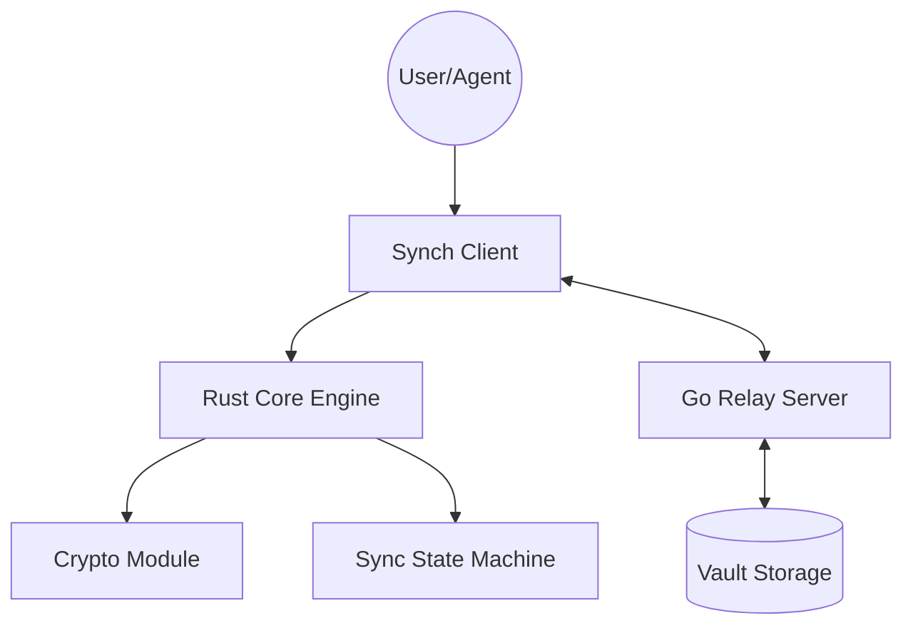

# SYNCH 心契协议 v0.1.0

[](https://github.com/nimoshaw/synch/actions)
[](https://github.com/nimoshaw/synch/releases)
[](LICENSE)

> 同步即契合，契约即连接。  
> Where synchronization becomes trust.

SYNCH 是一款去中心化的 Agent 通讯与多端数据同步协议。它旨在让 AI Agent 与人类用户之间实现跨平台、跨服务端的无缝连接与数据同步。

## 🌟 核心特性

- **端到端加密**: 基于 Ed25519/X25519 的强加密保障。
- **跨平台核心**: Rust 编写的 `core` 可通过 UniFFI 桥接到 Android, iOS 及 Desktop。
- **轻量级中继**: 高性能 Go 实现的 Relay Server，支持 WebSocket 实时同步。
- **插件化扩展**: 针对 VCP 和 OpenClaw 等 Agent 平台的深度集成。

## 🏗️ 核心架构



- **Core (Rust)**: 提供高性能、内存安全的加密与同步逻辑。
- **Server (Go)**: 实现中继 (Relay) 与联邦 (Federation) 协议。
- **Clients**:
  - **Plugins**: VCP-Agent, OpenClaw (TypeScript)
  - **Mobile**: Android (Kotlin), iOS (Swift)
- **Protocol**: 使用 Protobuf v3 定义跨端契约。

## 📂 目录结构

- `core/`: Rust 核心引擎
- `server/`: Go 中继服务端
- `clients/`: 各种客户端实现
- `proto/`: Protobuf 协议定义
- `docs/`: 详细文档与设计 (ADR)
- `tests/`: E2E 与集成测试

## 🚀 快速开始

### 1. 下载与安装
您可以从 [GitHub Releases](https://github.com/nimoshaw/synch/releases) 页面下载适用于您平台的预构建二进制文件：
- **Android APK**: `synch-android-v0.1.0.apk`
- **VCP Plugin**: `synch-plugin-v0.1.0.zip`
- **Relay Server**: `synch-relay-v0.1.0-<os>-<arch>`

### 2. 前置要求 (仅限开发者)
- Rust 1.75+
- Go 1.21+
- Node.js 18+
- [Task](https://taskfile.dev/)

### 2. 初始化环境
```bash
task init
```

### 3. 生成同步契约
```bash
task proto:gen
```

### 4. 部署与安装 (Deployment)

#### 🐳 Docker (推荐)
对于大多数用户，我们推荐使用 Docker Compose 快速启动：
```bash
# 启动包含 Redis 的完整环境
docker-compose up -d
```
*服务端将运行在 `8080` (API) 和 `8081` (WebSocket) 端口。*

#### 🐧 Linux 二进制
如果您更倾向于直接在 Linux 上运行：
1. **下载二进制文件**: 从 [Releases](https://github.com/nimoshaw/synch/releases) 获取针对 Linux 的版本。
2. **运行服务**:
   ```bash
   chmod +x synch-relay
   ./synch-relay
   ```
   *(请确保您的环境中已运行 Redis)*

> 详细的部署指南（包括 systemd 配置、环境变量及多环境部署）请参考 [DEPLOYMENT.md](docs/DEPLOYMENT.md)。

## 📄 开源协议
本项目采用 [MIT License](LICENSE) 授权。
