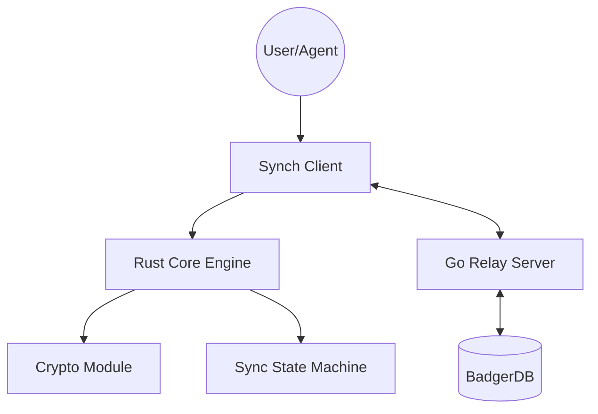

# SYNCH 心契协议

[](https://github.com/nimoshaw/synch/actions)
[](https://github.com/nimoshaw/synch/releases)
[](LICENSE)

> 同步即契合，契约即连接。  
> Where synchronization becomes trust.

SYNCH 是一款去中心化的 Agent 通讯与多端数据同步协议。它旨在让 AI Agent 与人类用户之间实现跨平台、跨服务端的无缝连接与数据同步。

## 🌟 核心特性

- **端到端加密** — 基于 Ed25519/X25519 的强加密保障
- **跨平台核心** — Rust 编写的 `core` 可通过 UniFFI 桥接到 Android, iOS 及 Desktop
- **轻量级中继** — 高性能 Go 实现的 Relay Server，支持 WebSocket 实时同步
- **插件化扩展** — 针对 VCP 和 OpenClaw 等 Agent 平台的深度集成
- **契约系统** — 节点间通过加密签名的契约建立信任关系
- **隐私分层** — 五级感知层级 (L0–L4) 控制节点可见性

## 🏗️ 架构概览



| 组件 | 语言 | 说明 |
|------|------|------|
| **Core** | Rust | 加密引擎、同步逻辑、UniFFI 绑定 |
| **Server** | Go | WebSocket 中继、隐私过滤器、Admin API |
| **VCP-Agent** | TypeScript | VCPToolBox 插件，后台 daemon 运行 |
| **Android** | Kotlin | 前台服务 + Material UI |
| **Protocol** | Protobuf v3 | 跨端消息契约定义 |

## 📂 目录结构

```
synch/
├── core/               # Rust 核心引擎 (synch-crypto, synch-sync, synch-ffi)
├── server/             # Go 中继服务端
├── clients/
│   ├── mobile/         # Android (Kotlin) / iOS (Planned)
│   └── plugins/        # VCP-Agent, OpenClaw-Agent (TypeScript)
├── proto/              # Protobuf v3 协议定义
├── shared/             # 跨端共享代码 (ts-core)
├── config/             # 环境配置文件 (dev/staging/prod)
├── deploy/             # Docker Compose, Helm, Terraform, 安装脚本
├── docs/               # 详细文档、ADR、API 参考
├── tests/              # E2E 与集成测试
├── Taskfile.yml        # 项目自动化任务
└── docker-compose.yml  # 一键开发环境启动
```

---

## 🚀 快速开始

### 方式一：Docker 一键启动（推荐，最简单）

> 适合：快速体验、开发测试、LAN 部署

**前置要求：** 仅需安装 [Docker](https://docs.docker.com/get-docker/)

```bash
# 1. 克隆仓库
git clone https://github.com/nimoshaw/synch.git
cd synch

# 2. 一键启动 Relay Server
docker compose up -d

# 3. 验证服务是否正常运行
curl http://localhost:8080/health
```

成功后你会看到类似输出：
```json
{"status":"ok","version":"dev","mode":"development","uptime":"0m","connected_clients":0}
```

服务端默认运行在 **`8080` 端口**（WebSocket + HTTP API 共用）。

---

### 方式二：预编译二进制文件（无需编译环境）

从 [GitHub Releases](https://github.com/nimoshaw/synch/releases) 下载对应平台的文件：

| 平台 | 文件 | 说明 |
|------|------|------|
| Linux (amd64) | `synch-relay-linux-amd64` | Relay 服务端二进制 |
| Linux (arm64) | `synch-relay-linux-arm64` | 适用于树莓派 / ARM 服务器 |
| Windows | `relay.exe` | Relay 服务端 |
| Android | `synch-android.apk` | 移动端 App |

**Linux 快速启动：**
```bash
# 下载并赋予执行权限
chmod +x synch-relay-linux-amd64

# 直接运行 (开发模式)
./synch-relay-linux-amd64 -mode development -log debug

# 或指定端口和数据目录
./synch-relay-linux-amd64 -addr :9090 -db /var/lib/synch/data
```

**Windows 快速启动：**
```powershell
# 直接运行
.\relay.exe -mode development -log debug
```

---

### 方式三：Linux 一键安装脚本（生产推荐）

```bash
curl -sSL https://raw.githubusercontent.com/nimoshaw/synch/main/deploy/scripts/install-server.sh | sudo bash
```

该脚本将自动：
- 检测 CPU 架构 (amd64/arm64)
- 创建 `synch` 系统用户
- 配置 systemd 服务（开机自启、崩溃自动重启）
- 生成配置文件模板 `/etc/synch/.env`

安装后操作：
```bash
# 编辑配置
sudo nano /etc/synch/.env

# 启动服务
sudo systemctl start synch-relay

# 设为开机自启
sudo systemctl enable synch-relay

# 查看日志
journalctl -u synch-relay -f
```

---

### 方式四：从源码构建（开发者）

**前置要求：**

| 工具 | 版本 | 用途 |
|------|------|------|
| [Go](https://golang.org/dl/) | 1.25+ | 编译 Relay Server |
| [Rust](https://www.rust-lang.org/tools/install) | 1.75+ | 编译 Core 引擎 |
| [Node.js](https://nodejs.org/) | 18+ | VCP-Agent 插件 |
| [Task](https://taskfile.dev/) | 最新 | 项目自动化工具 |
| [Buf](https://buf.build/) | 最新 | Protobuf 代码生成 |

```bash
# 1. 克隆仓库
git clone https://github.com/nimoshaw/synch.git
cd synch

# 2. 检查开发环境
task init

# 3. 生成 Protobuf 代码 (Go/TypeScript)
task proto:gen

# 4. 编译各组件
task build:server          # 编译 Go Relay Server
task build:core            # 编译 Rust Core (生成 FFI 动态库)
task build:vcp-agent       # 编译 VCP 插件

# 5. 启动本地开发服务器 (带 Debug 日志)
task debug:relay
```

---

## ⚙️ 配置参考

Relay Server 通过 **命令行参数** 或 **环境变量** 配置（CLI 优先）：

| 环境变量 | CLI 参数 | 说明 | 默认值 |
|----------|---------|------|--------|
| `SYNCH_WS_PORT` | `-addr` | 监听地址和端口 | `:8080` |
| `SYNCH_DB_PATH` | `-db` | BadgerDB 数据存储路径 | `./relay_db` |
| `SYNCH_MODE` | `-mode` | 运行模式 (`development` / `production`) | `production` |
| `SYNCH_LOG_LEVEL` | `-log` | 日志级别 (`debug` / `info` / `warn` / `error`) | `info` |
| `SYNCH_ADMIN_TOKEN` | — | Admin API Bearer Token（空=不鉴权） | 空 |
| `SYNCH_ALLOWED_ORIGINS` | — | 允许的 WebSocket Origin（逗号分隔，空=允许全部） | 空 |

**配置文件示例** (`config/dev.env`)：
```env
SYNCH_MODE=development
SYNCH_LOG_LEVEL=debug
SYNCH_WS_PORT=:8080
SYNCH_DB_PATH=./relay_db
```

---

## 🔌 客户端接入

### VCP-Agent 插件

```bash
cd clients/plugins/vcp-agent

# 1. 安装依赖
npm install

# 2. 配置连接信息
#    编辑 daemon/config.env，设置 SYNCH_RELAY_URL 和 VCP_KEY

# 3. 启动后台守护进程
npm run start:daemon
```

> 详细配置请参考 [VCP-Integration-Overview.md](clients/plugins/vcp-agent/VCP-Integration-Overview.md)

### Android 客户端

1. 安装 APK 或从 `clients/mobile/android/` 目录用 Android Studio 打开项目
2. 进入**设置页面**，输入 Relay Server 地址（如 `ws://192.168.1.100:8080`）
3. 返回主界面，点击连接按钮

---

## 📡 API 端点

| 端点 | 方法 | 说明 | 鉴权 |
|------|------|------|------|
| `/ws` | WebSocket | 实时通讯入口 | 无 |
| `/health` | GET | 健康检查（含版本、在线数等） | 无 |
| `/metrics` | GET | Prometheus 指标 | 无 |
| `/api/admin/status` | GET | 服务器状态详情 | Bearer Token |
| `/api/admin/nodes` | GET | 在线节点列表 | Bearer Token |
| `/api/admin/kick` | POST | 踢出指定节点 | Bearer Token |
| `/api/admin/contracts` | GET | 已建立的契约列表 | Bearer Token |

> 完整 API 文档请参考 [docs/API.md](docs/API.md)

---

## 🛠️ 常用命令速查

| 命令 | 说明 |
|------|------|
| `task init` | 检查开发环境 |
| `task proto:gen` | 生成 Protobuf 代码 |
| `task build:server` | 编译 Relay Server |
| `task build:core` | 编译 Rust Core |
| `task debug:relay` | 启动本地 Debug 服务 |
| `task test:all` | 运行所有测试 |
| `docker compose up -d` | Docker 一键启动 |

---

## 📚 文档导航

- [部署指南 DEPLOYMENT.md](docs/DEPLOYMENT.md) — Docker/systemd/Helm/Terraform 部署详解
- [API 参考 API.md](docs/API.md) — 协议消息和 HTTP 端点
- [架构决策 ADR-001](docs/ADR-001-architecture.md) — 核心架构设计文档
- [安全说明 SECURITY.md](docs/SECURITY.md) — 加密方案和安全实践
- [开发贡献 CONTRIBUTING.md](docs/CONTRIBUTING.md) — 如何参与开发
- [调试指南 DEBUGGING.md](docs/DEBUGGING.md) — 常见问题排查
- [路线图 ROADMAP.md](docs/ROADMAP.md) — 未来计划

## 📄 开源协议

本项目采用 [MIT License](LICENSE) 授权。
